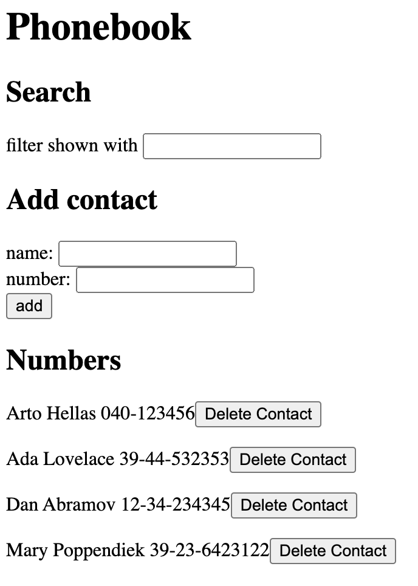

## Application

Link to application:
https://ivaninandan-phonebook.fly.dev/
# Book Catalogue

An application to keep track of your contacts. Add, remove and edit people from your phonebook and save them onto a server!

## Purpose

The purpose of this page is to implement a front-end application with React (useState and useEffect hooks), that's connected to a node.js/express back end. The application is launched and hosted on fly.io to store server data.
## Features

**React** - useEffect, useState and components used to build front end
**Node.js** - Back-end written in node.js
**Express** - Used to build APIs
**Axios** - Used to send HTTP requests
**nodemon** - Used for refreshing back-end server on save rather than having to restart
**morgan** - Used for logging HTTP requests to server console
**fly.io** - Application hosted on fly.io